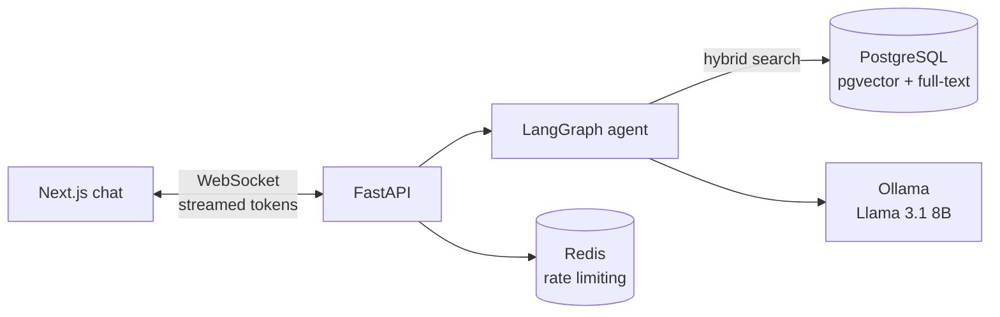
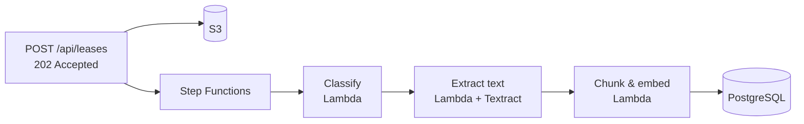
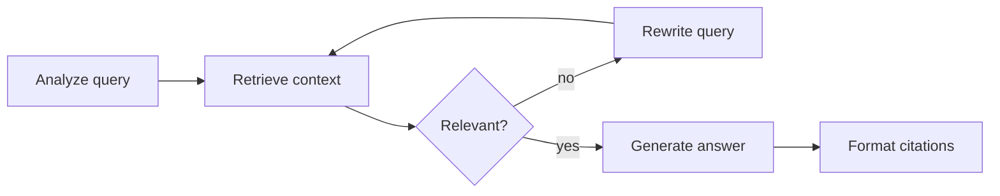

<div align="center">

# LeaseBuddy

**Ask questions about your lease and get answers with page citations, powered by a self-correcting RAG agent that runs on local LLMs**


</div>

## About

Leases are long, dense and easy to misread. LeaseBuddy lets a tenant upload their lease and ask plain-English questions such as "Can I break the lease early?" or "Are pets allowed?". Answers come only from the document, cite the page they came from, and it says "I cannot find this in the lease" instead of guessing.

Uploads are processed asynchronously by an AWS pipeline (S3, Step Functions and Lambda), questions are answered by a LangGraph agent over hybrid vector and keyword search in PostgreSQL, and the answer streams to the browser token by token. The models run locally through Ollama.

## Features

- **Upload a lease** as a PDF or image (up to 20 MB). Scanned documents go through Textract OCR in the processing pipeline.
- **Ask questions in a chat** and watch the answer stream in live over a WebSocket.
- **Page citations** on every answer, with the supporting passages.
- **Honest refusals**: questions the lease doesn't answer get "I cannot find this in the lease."
- **Rate limiting** per client IP (sliding window in Redis).

## Evaluation

Every number comes from the evaluation suite in [`backend/evals`](backend/evals), run on 6 synthetic leases (96 pages) with 222 questions that have recorded answers, pages and clauses. Full report: [`backend/results/METRICS.md`](backend/results/METRICS.md).

| Metric | Result |
| --- | --- |
| Retrieval: correct clause in the top 5 (hybrid search) | **100%** (198/198) |
| Retrieval: correct clause ranked first (hybrid vs vector only) | **86.4%** vs 81.8% |
| Answer accuracy, given the right context | **89.9%** (178/198) |
| Answer accuracy, end to end through the agent | **77.8%** (35/45) |
| Correct refusals on unanswerable questions | **100%** (24/24) |
| Answer faithfulness to the context (LLM judge) | **96.8%** (215/222) |

The questions are split into lookups, multi-hop questions that combine two clauses, adversarial questions with a confusable clause nearby (pet rent vs pet deposit, late fee vs NSF fee), and unanswerable ones.

## Tech stack

| Layer | Technologies |
| --- | --- |
| Frontend | Next.js 16, React 19, TypeScript, Tailwind CSS 4 |
| Backend | FastAPI, WebSockets, SQLAlchemy 2 (async), Alembic |
| AI / RAG | LangGraph, LlamaIndex, Ollama (Llama 3.1 8B, nomic-embed-text) |
| Data | PostgreSQL with pgvector (HNSW index) and full-text search, Redis |
| Document processing | AWS S3, Step Functions, Lambda (container images), Textract |
| Tooling | Poetry, Bun, Docker Compose, LocalStack, GitHub Actions |

## Architecture

**Asking a question**



**Processing an upload**



**The agent** analyzes the question, retrieves context, and checks that the context is relevant before answering. If it isn't, it rewrites the search keywords and retrieves once more instead of answering from the wrong clause.



## Technical highlights

- **Hybrid search with Reciprocal Rank Fusion.** One SQL query runs pgvector cosine search and Postgres full-text search, then merges the two rankings with RRF (k = 60). In the evaluation it ranks the right clause first more often than vector search alone (86.4% vs 81.8%), while keyword search alone manages only 21.2%.
- **An agent that checks its own retrieval.** Before generating, the LangGraph agent asks the LLM whether the retrieved passages answer the question, and reformulates the search if they don't. 23 of 60 end-to-end questions needed that second pass.
- **Asynchronous, serverless ingestion.** Uploads return 202 right away. S3 and Step Functions drive container-image Lambdas that classify the document, extract text (OCR through Textract for scans), then chunk and embed it into pgvector, while the frontend polls for the status.
- **Real token streaming.** Answers stream from Ollama to the browser over a WebSocket as they are generated, with citations sent once the answer is complete.
- **Measured, not claimed.** The evaluation suite scores retrieval, answers, refusals and citations against ground truth, and also checks infrastructure claims such as the index, rate limit and upload limits against a running API.

## Getting started

### Prerequisites

- Docker and Docker Compose
- [Ollama](https://ollama.com) for local model inference
- Python 3.11+ with [Poetry](https://python-poetry.org)
- [Bun](https://bun.sh) (or Node.js 20+)

### Setup

```bash
git clone https://github.com/ianjhh/leasebuddy.git
cd leasebuddy
cp .env.example .env                  # then set API_SECRET_KEY

make start_docker                     # PostgreSQL, Redis, Ollama and LocalStack

ollama pull llama3.1:8b               # or the model you set as LLM_MODEL
ollama pull nomic-embed-text
```

Start the API (tables are created on startup; run the migrations to add the HNSW index to an existing database):

```bash
cd backend
poetry install
poetry run alembic upgrade head
poetry run uvicorn app.main:app --reload
```

Start the frontend in a second terminal:

```bash
cd frontend
bun install
bun dev
```

Then open [http://localhost:3000](http://localhost:3000). The API documentation is at [http://localhost:8000/docs](http://localhost:8000/docs).

### Useful commands

| Command | Description |
| --- | --- |
| `make start_docker` / `make stop_docker` | Start or stop the local services |
| `make logs` | Follow the service logs |
| `make db-shell` | Open a psql shell |
| `make backend-shell` | Open a shell in the backend container |

## Testing and evaluation

```bash
cd backend
poetry run pytest tests/ -v           # unit tests and golden QA checks
poetry run ruff check .               # linting
poetry run mypy .                     # type checking

poetry run python -m evals.report     # rebuild results/METRICS.md from the latest runs
```

`backend/evals/run_all.sh` starts PostgreSQL and Redis, ingests the synthetic corpus, and runs the retrieval, end-to-end and infrastructure evaluations. GitHub Actions lints, type-checks and tests the backend and frontend on every push and pull request.

## Project structure

```
leasebuddy/
├── backend/
│   ├── app/
│   │   ├── api/            # routes (upload, chat WebSocket, health) and middleware
│   │   ├── rag/            # LangGraph agent, hybrid retriever, indexer, prompts
│   │   ├── models/         # SQLAlchemy models (leases, chunks with embeddings)
│   │   ├── services/       # document processing, chat service
│   │   └── main.py         # FastAPI app
│   ├── alembic/            # database migrations
│   ├── evals/              # evaluation suite and dataset generator
│   ├── results/            # evaluation results and METRICS.md
│   └── tests/              # unit tests and golden QA set
├── frontend/               # Next.js app: upload page and chat
├── lambdas/                # classify, extract and chunk_embed Lambdas
├── infra/
│   ├── aws/                # Step Functions, S3 event and IAM definitions
│   ├── aws_deployment/     # deployment script
│   └── docker/             # docker-compose for local services
└── Makefile
```

## Author

Built by [@ianjhh](https://github.com/ianjhh) · [Portfolio](https://ian-joseph.netlify.app/) · [LinkedIn](https://linkedin.com/in/ianjhh)
