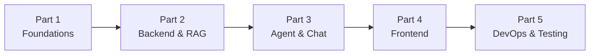

# 📚 LeaseGPT Tutorial — Master Index

A comprehensive, beginner-friendly tutorial for building **LeaseGPT** — a production-grade lease document Q&A system powered by AI.

> [!NOTE]
> This tutorial assumes you're **new to all these technologies** and explains every concept from scratch with analogies, diagrams, and detailed code comments.

---

## Tutorial Parts

| # | Part | Chapters | Size |
|---|---|---|---|
| 1 | [**Foundations & Database**](file:///C:/Users/ianjh/.gemini/antigravity/brain/102aaf0a-dbd6-4c46-8736-322da662ea93/tutorial_part1_foundations.md) | Ch 0-3: Big Picture, Setup, Scaffolding, PostgreSQL + pgvector | ~29 KB |
| 2 | [**Backend API & RAG Pipeline**](file:///C:/Users/ianjh/.gemini/antigravity/brain/102aaf0a-dbd6-4c46-8736-322da662ea93/tutorial_part2_backend_api.md) | Ch 4-6: FastAPI, Document Processing, Chunking/Embedding/Retrieval | ~27 KB |
| 3 | [**AI Agent & WebSocket Chat**](file:///C:/Users/ianjh/.gemini/antigravity/brain/102aaf0a-dbd6-4c46-8736-322da662ea93/tutorial_part3_agent_and_chat.md) | Ch 7-9: LangGraph Agent, Real-time Streaming, Backend Integration | ~24 KB |
| 4 | [**Frontend (Next.js)**](file:///C:/Users/ianjh/.gemini/antigravity/brain/102aaf0a-dbd6-4c46-8736-322da662ea93/tutorial_part4_frontend.md) | Ch 10: TypeScript, TailwindCSS, Components, Hooks, Pages | ~52 KB |
| 5 | [**AWS, DevOps & Testing**](file:///C:/Users/ianjh/.gemini/antigravity/brain/102aaf0a-dbd6-4c46-8736-322da662ea93/tutorial_part5_aws_devops_testing.md) | Ch 11-16: Lambda, Step Functions, Docker, K8s, CI/CD, Ragas | ~44 KB |
| | **Total** | **16 Chapters** | **~176 KB** |

---

## Reading Order

Start from Part 1 and work through sequentially — each part builds on the previous one.

---

## Reference Documents

- [**Implementation Plan**](file:///C:/Users/ianjh/.gemini/antigravity/brain/102aaf0a-dbd6-4c46-8736-322da662ea93/implementation_plan.md) — Architecture overview, resolved decisions, component breakdown

---

## Tech Stack Quick Reference

| Layer | Technology | Covered In |
|---|---|---|
| Frontend | Next.js, TypeScript, TailwindCSS | Part 4 |
| Backend API | Python, FastAPI, WebSockets | Parts 2-3 |
| AI Agent | LangGraph | Part 3 |
| RAG Pipeline | LlamaIndex, pgvector, Hybrid Search | Part 2 |
| LLM | Ollama (llama3.1:8b) — free, local | Parts 1-3 |
| Embeddings | nomic-embed-text (768d) — free, local | Part 2 |
| Database | PostgreSQL + pgvector | Part 1 |
| Cache | Redis | Parts 1-3 |
| Cloud | AWS S3, Lambda, Step Functions, Textract | Part 5 |
| Containers | Docker, Kubernetes (kind) | Part 5 |
| CI/CD | GitHub Actions | Part 5 |
| Testing | pytest, Jest, Ragas | Part 5 |
