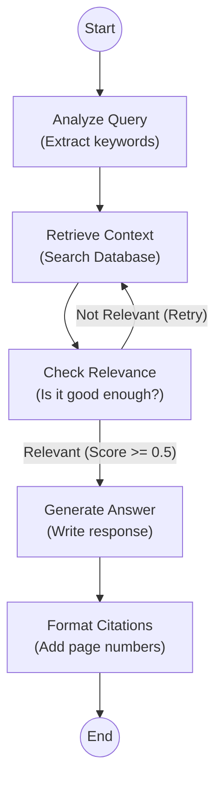
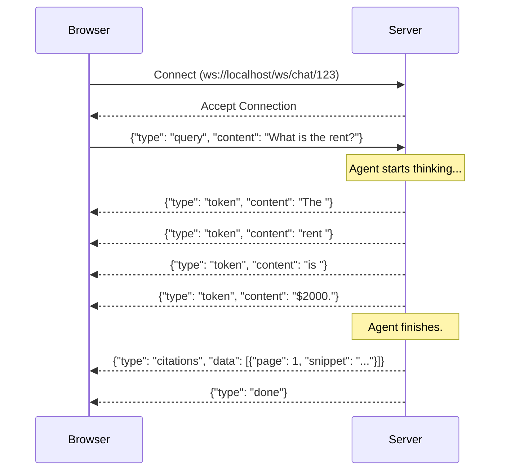

# LeaseGPT Tutorial - Part 3: The AI Agent and Real-Time Chat

Welcome to Part 3 of the LeaseGPT tutorial! In Parts 1 and 2, we set up our backend architecture, built the document processing pipeline to read PDFs, and created our Retrieval-Augmented Generation (RAG) system using LlamaIndex and pgvector. 

Now, it's time to build the **Brain** (the AI Agent) and the **Mouth/Ears** (Real-Time WebSockets) of our application. We want users to be able to ask questions and watch the AI type out the answer in real-time, just like ChatGPT.

---

## Chapter 7: The AI Agent (LangGraph)

### What is an AI Agent?

Think of a traditional computer program as a fast-food worker strictly following a recipe: *Put bun, add burger, add cheese, add bun.* It does exactly what you say, in the exact order, every single time.

An **AI Agent** is more like a **Detective**. When you ask a detective a question, they don't just blurt out an answer. They:
1. **Analyze** what you're asking.
2. **Gather Evidence** (look through files).
3. **Evaluate** if the evidence is good enough (if not, they search again).
4. **Write a Report** based *only* on the evidence they found.

Instead of a hardcoded recipe, an agent uses a Large Language Model (LLM) to make *decisions* about what to do next.

### What is a Graph?

To organize our detective's workflow, we use **LangGraph**. A "graph" in computer science is just a map of connected points.
*   **Nodes (Steps):** The actual tasks (e.g., "Analyze", "Retrieve", "Generate Answer"). In our code, these are just Python functions.
*   **Edges (Connections):** The arrows pointing from one step to the next.
*   **Conditional Edges (Decisions):** Forks in the road. (e.g., *Is the evidence good enough? Yes -> Generate Answer. No -> Go back and Retrieve again.*)

### What is State?

As the detective moves from step to step, they carry a **Case File**. In LangGraph, this is called **State**. It's an object (a bundle of data) that gets passed to a node. The node reads the state, updates it with new information, and passes it to the next node. 

Here is the visual map of the Graph we are about to build:



### 1. The LangGraph Q&A Agent

Let's write the code for our detective. Create a new file at `backend/app/rag/agent.py`.

```python
# backend/app/rag/agent.py

import json
import logging
from typing import Optional, List, Dict, Any, AsyncGenerator
from uuid import UUID
from pydantic import BaseModel, Field
from langgraph.graph import StateGraph, END
# We use LlamaIndex for the actual LLM calls
from llama_index.core.llms import ChatMessage, MessageRole
from llama_index.llms.ollama import Ollama

from app.rag.retriever import hybrid_search
from app.config import settings
from app.api.dependencies import get_db

logger = logging.getLogger(__name__)

# ---------------------------------------------------------
# 1. DEFINE THE STATE (The Detective's Case File)
# ---------------------------------------------------------
class ChunkResult(BaseModel):
    """Represents a piece of text found in the database."""
    id: str
    text: str
    page: int
    score: float

class Citation(BaseModel):
    """Represents a source reference for the user."""
    page_num: int
    snippet: str

class QAState(BaseModel):
    """
    This is our State. It holds all the information as we move 
    through the graph. Notice how many fields are Optional? 
    That's because they start empty and get filled in step-by-step.
    """
    lease_id: UUID
    query: str
    # What the LLM thinks the user is asking
    query_analysis: Optional[Dict[str, Any]] = None  
    # The text chunks we pull from Postgres
    retrieved_chunks: List[ChunkResult] = Field(default_factory=list)
    # How good the chunks are (0.0 to 1.0)
    relevance_score: Optional[float] = None
    # The final written response
    answer: Optional[str] = None
    # Where we found the info
    citations: List[Citation] = Field(default_factory=list)
    # How many times we've looped back to retry
    retry_count: int = 0
    # Any errors that happen
    error: Optional[str] = None

# ---------------------------------------------------------
# 2. INITIALIZE THE LLM
# ---------------------------------------------------------
# We use Ollama running locally. 
llm = Ollama(model=settings.LLM_MODEL, base_url=settings.OLLAMA_BASE_URL, request_timeout=120.0)

# ---------------------------------------------------------
# 3. DEFINE THE NODES (The Steps in the Workflow)
# ---------------------------------------------------------

async def analyze_query(state: QAState) -> QAState:
    """
    Node 1: Look at the user's question and extract key terms.
    """
    # Create a prompt telling the LLM to act like a keyword extractor
    prompt = f"""
    Analyze the following query about a lease agreement.
    Extract the main entities and keywords for searching.
    Return ONLY valid JSON with a 'keywords' list.
    Query: {state.query}
    """
    
    # Send the prompt to the LLM
    response = await llm.acomplete(prompt)
    
    try:
        # Try to parse the LLM's text output into a Python dictionary
        analysis = json.loads(response.text)
        state.query_analysis = analysis
    except (json.JSONDecodeError, ValueError):
        logger.warning("Failed to parse query analysis JSON, falling back to raw query.")
        # If the LLM didn't return perfect JSON, just fallback to the raw query
        state.query_analysis = {"keywords": [state.query]}
        
    return state

async def retrieve_context(state: QAState) -> QAState:
    """
    Node 2: Search the database using the keywords.
    """
    # Grab the keywords we generated in the last step
    keywords = state.query_analysis.get("keywords", [state.query])
    search_term = " ".join(keywords)
    
    # Call our hybrid search function (from Part 2)
    # We open a brief DB session just for the retrieval
    async for db_session in get_db():
        raw_chunks = await hybrid_search(db_session, state.lease_id, search_term, limit=5)
        break  # We only need one session
    
    # Convert raw dicts into our Pydantic model
    state.retrieved_chunks = [ChunkResult(**c) for c in raw_chunks]
    # We increment the retry count every time we hit this node
    state.retry_count += 1 
    
    return state

async def check_relevance(state: QAState) -> QAState:
    """
    Node 3: LLM-as-a-Judge. Are these chunks actually helpful?
    """
    context_str = "\n".join([c.text for c in state.retrieved_chunks])
    
    prompt = f"""
    Given the user's question and the retrieved lease context, rate how relevant 
    the context is for answering the question on a scale of 0.0 to 1.0.
    Return ONLY a number.
    Question: {state.query}
    Context: {context_str}
    """
    
    response = await llm.acomplete(prompt)
    
    try:
        # Parse the number out of the text
        score = float(response.text.strip())
        state.relevance_score = score
    except (ValueError, TypeError):
        logger.warning("Failed to parse relevance score, defaulting to 1.0.")
        # If we can't parse it, assume it's good enough to proceed
        state.relevance_score = 1.0
        
    return state

async def generate_answer(state: QAState) -> QAState:
    """
    Node 4: Write the final answer using the context.
    """
    # Combine all our chunks into a big string of context
    context_str = ""
    for idx, chunk in enumerate(state.retrieved_chunks):
        # We add [Page X] tags so the LLM knows where the info came from
        context_str += f"[Page {chunk.page}] {chunk.text}\n"
        
    prompt = f"""
    You are a helpful real estate assistant. Answer the user's question using ONLY 
    the provided context from their lease agreement. 
    Whenever you state a fact, cite the page number like this: (Page X).
    If the context does not contain the answer, say "I cannot find this in the lease."
    
    Context:
    {context_str}
    
    Question: {state.query}
    """
    
    # Get the final answer from the LLM
    response = await llm.acomplete(prompt)
    state.answer = response.text
    
    return state

async def format_citations(state: QAState) -> QAState:
    """
    Node 5: Clean up the data for the frontend.
    """
    # For every chunk we used, create a Citation object
    # The frontend will use this to show clickable reference links
    state.citations = [
        Citation(page_num=c.page, snippet=c.text) 
        for c in state.retrieved_chunks
    ]
    return state

# ---------------------------------------------------------
# 4. CONDITIONAL LOGIC (Forks in the road)
# ---------------------------------------------------------
def should_retry(state: QAState) -> str:
    """
    This function doesn't return a state. It returns the NAME of the next node.
    """
    # If the context sucks (score < 0.5) AND we haven't retried too many times...
    if state.relevance_score < 0.5 and state.retry_count < 2:
        return "retrieve_context" # Go back and search again
    
    # Otherwise, move on to generating the answer
    return "generate_answer"

# ---------------------------------------------------------
# 5. BUILD THE GRAPH
# ---------------------------------------------------------
# Create a new graph that uses our QAState structure
workflow = StateGraph(QAState)

# Add all our Python functions as nodes in the graph
workflow.add_node("analyze_query", analyze_query)
workflow.add_node("retrieve_context", retrieve_context)
workflow.add_node("check_relevance", check_relevance)
workflow.add_node("generate_answer", generate_answer)
workflow.add_node("format_citations", format_citations)

# Define the normal flow (the arrows)
workflow.set_entry_point("analyze_query")
workflow.add_edge("analyze_query", "retrieve_context")
workflow.add_edge("retrieve_context", "check_relevance")

# Add the fork in the road! 
# Depending on what `should_retry` returns, route to the next node.
workflow.add_conditional_edges(
    "check_relevance",
    should_retry,
    {
        "retrieve_context": "retrieve_context", # If it returns this string, go here
        "generate_answer": "generate_answer"    # If it returns this string, go here
    }
)

# Finish the flow
workflow.add_edge("generate_answer", "format_citations")
workflow.add_edge("format_citations", END)

# Compile turns this map into an executable program
app = workflow.compile()

# ---------------------------------------------------------
# 6. RUNNER FUNCTION
# ---------------------------------------------------------
async def run_agent(lease_id: UUID, query: str) -> QAState:
    """
    A helper function to kick off the graph.
    """
    # Create the initial empty state
    initial_state = QAState(lease_id=lease_id, query=query)
    
    # Run the graph (this is an asynchronous call)
    # LangGraph returns a dictionary, so we unpack it back into our Pydantic model
    final_dict = await app.ainvoke(initial_state.dict())
    
    return QAState(**final_dict)
```

#### What just happened?
1. **State:** We defined a "Case File" (`QAState`) using Pydantic. It holds the `query`, `chunks`, `answer`, etc.
2. **Nodes:** We wrote five `async` Python functions. Each takes the `state`, does some work (often asking the AI something), and modifies the `state`.
3. **Graph Setup:** We glued it all together using `StateGraph`. 
4. **Conditional Logic:** The magic happens in `should_retry`. It evaluates `relevance_score` and tells LangGraph whether to move forward or loop back.

> [!NOTE] 
> Why use LangGraph instead of just calling these functions in a row? 
> Because graphs give us **loops** and **memory**. If the search fails, the agent can loop back automatically. In complex apps, you can even pause a graph, ask the user a question, and resume it later!

### 2. The Chat Service

The agent handles the "thinking", but we need a service to handle the "business logic" (saving chat history to the database, checking Redis for cached answers so we don't pay for AI twice, etc.).

Create `backend/app/services/chat_service.py`:

```python
# backend/app/services/chat_service.py

import json
import hashlib
import logging
from typing import Dict, Any
from uuid import UUID
# Imagine we have an async Redis client configured
from app.api.dependencies import get_db, get_redis
from app.config import settings

from app.rag.agent import run_agent

logger = logging.getLogger(__name__)

async def generate_chat_response(lease_id: UUID, query: str, session_id: str) -> Dict[str, Any]:
    """
    Manages the full lifecycle of a user asking a question.
    """
    # 1. Create a unique fingerprint (hash) for this specific question
    query_hash = hashlib.md5(query.encode()).hexdigest()
    cache_key = f"chat_cache:{lease_id}:{query_hash}"
    
    # 2. Check Cache (Redis)
    # If a user asks "What is the rent?" twice, we don't want to run the AI twice.
    async for redis_client in get_redis():
        cached_answer = await redis_client.get(cache_key)
        if cached_answer:
            logger.info("Cache hit for lease %s, query hash %s", lease_id, query_hash)
            return json.loads(cached_answer)
        break
        
    # 3. If not cached, RUN THE AGENT (The Brain!)
    final_state = await run_agent(lease_id, query)
    
    # 4. Format the result for the frontend
    response_data = {
        "answer": final_state.answer,
        "citations": [c.dict() for c in final_state.citations]
    }
    
    # 5. Save to Cache for next time (expires in 1 hour)
    async for redis_client in get_redis():
        await redis_client.setex(cache_key, settings.CACHE_TTL_SECONDS, json.dumps(response_data))
        break
    
    # 6. Save messages to Postgres Database (User's question + AI's answer)
    # (In a full app, you would define a ChatMessage model and save here)
    # async for db_session in get_db():
    #     db_session.add(ChatMessage(session_id=session_id, role="user", content=query))
    #     db_session.add(ChatMessage(session_id=session_id, role="assistant", content=final_state.answer))
    #     await db_session.commit()
    #     break
    
    return response_data
```

#### What just happened?
This acts as a wrapper around our agent. It takes the query, checks if we already know the answer (Redis caching), runs the agent if we don't, and then saves the conversation to our Postgres database so the user can see their chat history when they refresh the page.

---

## Chapter 8: Real-Time Chat (WebSockets)

### What is a WebSocket?

**HTTP (Normal Web Traffic):** Like sending a letter. 
You (the client) put a letter in a mailbox asking a question. You wait. A few days later, the server sends a single letter back with the whole answer. The connection closes.

**WebSocket:** Like a phone call.
You dial the server. The server picks up. Now, the line is open. You can talk at any time, and the server can talk at any time, instantly. The connection stays open until someone hangs up.

> [!TIP]
> **Why do we need this?**
> LLMs (like ChatGPT) take time to generate text. If we used HTTP, the user would stare at a loading spinner for 10 seconds. With WebSockets, we can **STREAM** the answer. The server sends the text back word-by-word (`"The"`, `"rent"`, `"is"`, `"$2000"`) as it is generated, so the user sees it typing out instantly!

### The WebSocket Message Flow

Here's how our server and browser will talk to each other:



### 1. The WebSocket Endpoint

Create `backend/app/api/routes/chat.py`. This is our FastAPI route that handles the "phone call".

```python
# backend/app/api/routes/chat.py

from fastapi import APIRouter, WebSocket, WebSocketDisconnect
from uuid import UUID
import json
import asyncio
import logging

# Import our chat service
from app.services.chat_service import generate_chat_response

logger = logging.getLogger(__name__)

router = APIRouter()

@router.websocket("/ws/chat/{lease_id}")
async def websocket_chat(websocket: WebSocket, lease_id: UUID) -> None:
    """
    This endpoint stays open as long as the user is on the chat page.
    """
    # 1. "Pick up the phone" - Accept the connection from the browser
    await websocket.accept()
    
    try:
        # 2. Enter a loop to constantly listen for incoming messages
        while True:
            # Wait for the browser to send us text
            raw_message = await websocket.receive_text()
            
            # Parse the JSON string into a Python dictionary
            data = json.loads(raw_message)
            
            # Check what kind of message it is
            if data.get("type") == "query":
                user_query = data.get("content")
                session_id = data.get("session_id", "default")
                
                # We need to simulate streaming. 
                # In a real app, you would modify the LangGraph agent to `yield` tokens.
                # For this beginner tutorial, we will fetch the whole answer, 
                # and then stream it out word-by-word to simulate the effect.
                
                response = await generate_chat_response(lease_id, user_query, session_id)
                answer_text = response["answer"]
                
                # SIMULATE STREAMING (Sending tokens one by one)
                words = answer_text.split(" ")
                for word in words:
                    # Send a chunk (token) to the frontend
                    await websocket.send_json({
                        "type": "token",
                        "content": word + " " # add the space back
                    })
                    # Pause for a tiny fraction of a second to make it look like typing
                    await asyncio.sleep(0.05) 
                
                # Send the citations after the text is done
                await websocket.send_json({
                    "type": "citations",
                    "data": response["citations"]
                })
                
                # Tell the frontend we are completely done with this question
                await websocket.send_json({
                    "type": "done"
                })

    except WebSocketDisconnect:
        # The user closed the browser tab ("Hung up the phone")
        logger.info("Client disconnected from lease %s", lease_id)
        
    except Exception as e:
        logger.exception("WebSocket error for lease %s", lease_id)
        # Something crashed! Let the frontend know.
        await websocket.send_json({
            "type": "error",
            "message": str(e)
        })
```

#### What just happened?
1. **`await websocket.accept()`**: Establishes the real-time connection.
2. **`while True:`**: A continuous loop that waits for the user to send a message.
3. **`receive_text()` & `json.loads()`**: Listens for the user's data. We expect it to look like `{"type": "query", "content": "..."}`.
4. **Simulated Streaming**: We split the final answer into words and use a `for` loop combined with `asyncio.sleep(0.05)` to send them piece-by-piece via `send_json`. 
5. **Exception Handling**: If the user closes the tab, a `WebSocketDisconnect` error is thrown, which we catch gracefully so our server doesn't crash.

> [!CAUTION]
> **Real Streaming vs Simulated**: In this tutorial, we simulate streaming by getting the whole answer first, then breaking it apart. This is to keep LangGraph simple. In production, you would configure the LlamaIndex LLM to use `stream=True` and pass those chunks directly into the WebSocket.

### 2. Route Registration

Now that we have our WebSocket route, we need to tell FastAPI about it. 
In Part 2, we already created `backend/app/main.py` and registered our `health` and `upload` routes.
Let's add our new `chat` router to it!

Open your existing `backend/app/main.py` and add the import and registration:

```python
# inside main.py
from app.api.routes import health, upload, chat  # Add chat here!

# ... (existing middleware and routers)

app.include_router(health.router, prefix="/health", tags=["Health"])
app.include_router(upload.router, prefix="/api/leases", tags=["Upload"])
# Register our new WebSocket chat route
app.include_router(chat.router, tags=["Chat"])
```

---

## Chapter 9: Putting the Backend Together

We have written a lot of code! Let's get it running on your Windows machine.

Open your Windows command prompt or PowerShell. Navigate to your backend folder.

```powershell
cd C:\path\to\your\LeaseGPT\backend

# All dependencies are already managed via pyproject.toml.
# If you haven't installed them yet, run:
poetry install
```

### 2. Start the Server

To run our FastAPI application, we use a server called **Uvicorn**.

```powershell
# Run the app.main file, looking for the 'app' variable.
# --reload means it will automatically restart if you save a code change!
poetry run uvicorn app.main:app --reload --host 0.0.0.0 --port 8000
```
You should see green text saying `Application startup complete.`.

### 3. Test the API Manually (Swagger UI)

FastAPI gives you a free, auto-generated testing website!
1. Open your browser and go to: `http://localhost:8000/docs`
2. You will see a beautiful interface listing all your routes.
3. *Note: WebSockets don't easily test in Swagger.*

### 4. Test the WebSocket Real-Time Chat

To test a WebSocket on Windows without building a frontend React app yet, we can use a simple HTML file.

Create a temporary file on your Desktop called `test_chat.html`:

```html
<!DOCTYPE html>
<html>
<body>
    <h2>LeaseGPT Chat Test</h2>
    <input type="text" id="query" placeholder="Ask a question..." style="width: 300px;">
    <button onclick="sendMsg()">Send</button>
    <div id="chatbox" style="margin-top: 20px; border: 1px solid black; padding: 10px; min-height: 200px;"></div>

    <script>
        // Connect to our FastAPI WebSocket
        // Fake lease UUID for testing
        let ws = new WebSocket("ws://localhost:8000/ws/chat/123e4567-e89b-12d3-a456-426614174000");
        let chatbox = document.getElementById("chatbox");

        ws.onmessage = function(event) {
            let data = JSON.parse(event.data);
            
            if (data.type === "token") {
                // Append the word as it arrives!
                chatbox.innerHTML += data.content;
            } else if (data.type === "citations") {
                chatbox.innerHTML += "<br><br><i>Source: Page " + data.data[0].page_num + "</i><br><br>";
            }
        };

        function sendMsg() {
            let input = document.getElementById("query");
            chatbox.innerHTML += "<b>You:</b> " + input.value + "<br><b>AI:</b> ";
            
            // Send the JSON format our backend expects
            ws.send(JSON.stringify({
                type: "query",
                content: input.value
            }));
            
            input.value = ""; // clear input
        }
    </script>
</body>
</html>
```

Double click `test_chat.html` to open it in Chrome or Edge. 
Type a question like "What is the rent?" and hit Send.
You should see the AI's answer magically typing out onto the screen word by word!

### Conclusion of Part 3

Congratulations! You have successfully built:
1. A **LangGraph Agent** that can analyze intent, retrieve context, judge relevance, and format answers.
2. A **WebSocket server** capable of pushing real-time tokens to a browser, giving that premium ChatGPT-style feel.

In **Part 4**, we will move to the Frontend and build the sleek Next.js React interface so users can drag-and-drop their PDFs and chat in a beautiful UI.
