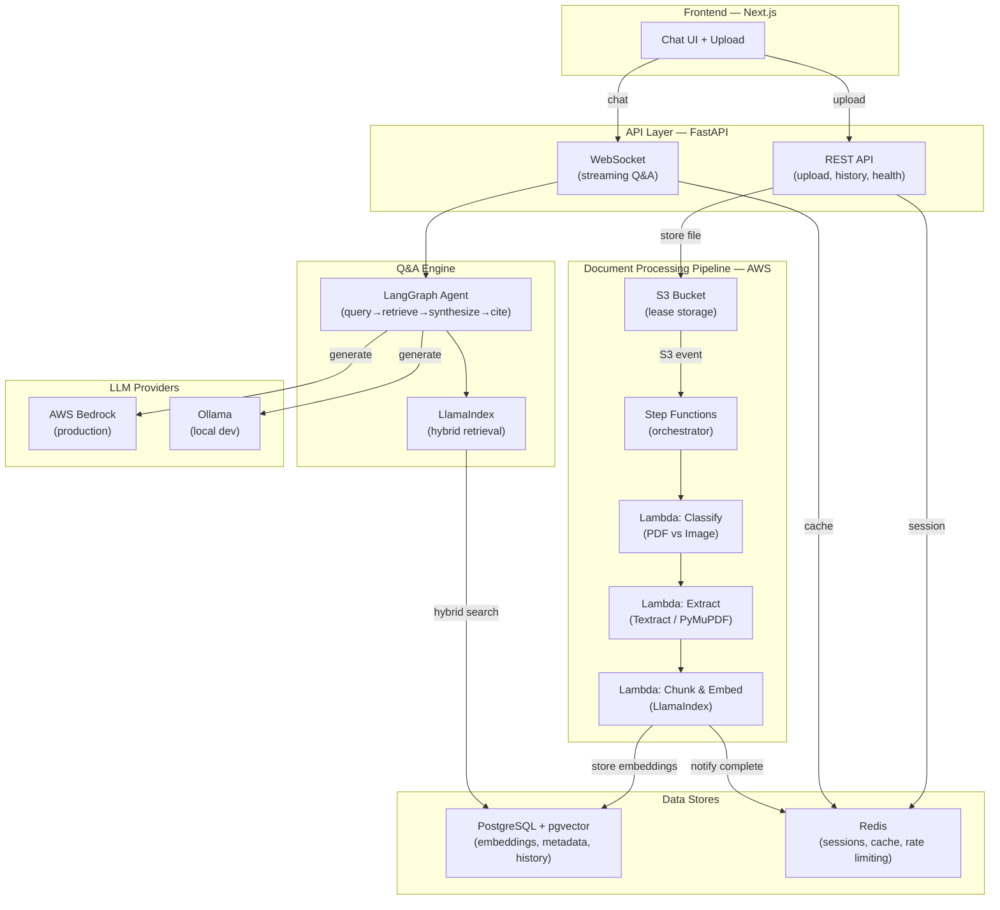
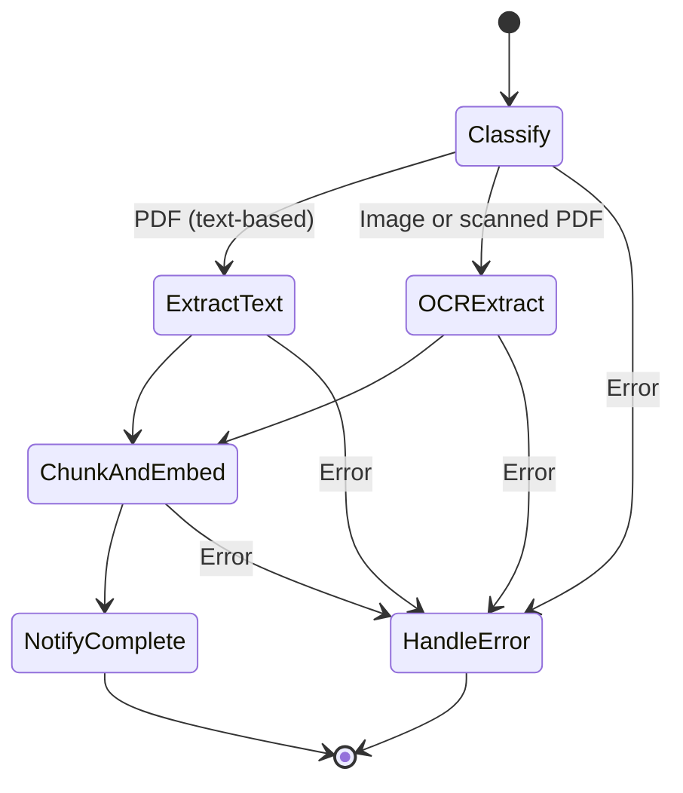
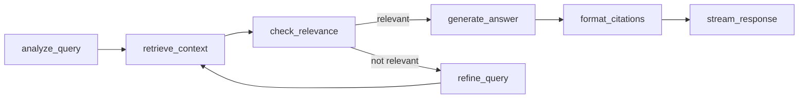
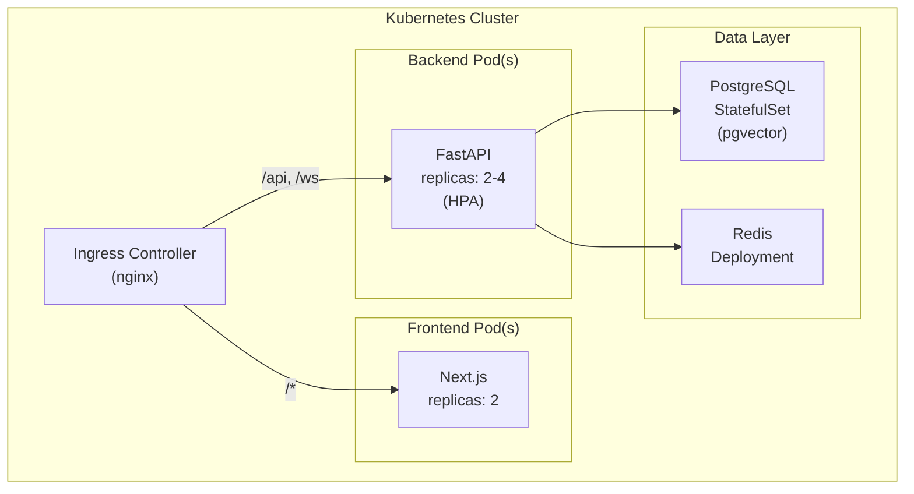

# LeaseGPT — Production-Grade Lease Q&A System

A system that accepts lease documents (PDF or scanned images), extracts and indexes their content, and allows users to ask natural language questions about the lease through a real-time chat interface. Answers are grounded exclusively in the uploaded lease document with citations.

---

## Decisions Summary

| Decision | Choice | Rationale |
|---|---|---|
| Agent Orchestration | LangGraph only (no CrewAI) | Simpler stack; LangGraph covers all orchestration needs for single-doc Q&A |
| RAG Evaluation | Ragas only (no DeepEval) | Handles batch eval in CI/CD; avoids redundant eval frameworks |
| Cloud LLM | AWS Bedrock (prod) + Ollama (dev) | Unified AWS billing, IAM auth, multi-model access |
| OCR | AWS Textract | Best fit for existing AWS stack, high accuracy for documents |
| Project Name | LeaseGPT | — |

## Tech Stack (Final, No Overlaps)

| Layer | Technologies |
|---|---|
| Frontend | Next.js, TypeScript, TailwindCSS |
| Backend & API | Python 3.12, FastAPI, WebSockets |
| LLM & Orchestration | LangGraph, LlamaIndex, Pydantic, Tenacity, AWS Bedrock (prod), Ollama (dev) |
| Retrieval & Eval | Hybrid RAG (semantic + keyword), pgvector, Ragas |
| Database & Cache | PostgreSQL (pgvector), Redis |
| Document Processing | AWS Textract (OCR), PyMuPDF (PDF text extraction) |
| Cloud & Serverless | AWS S3, Step Functions, Lambda |
| DevOps | Docker, Kubernetes (kind/minikube), GitHub Actions |
| Testing | pytest (backend), Jest (frontend) |

---

## Architecture Overview



---

## Monorepo Structure

```
leasegpt/
├── .github/
│   └── workflows/
│       ├── ci.yml                  # Lint, test, build on PR
│       ├── cd-staging.yml          # Deploy to staging on merge to develop
│       └── cd-production.yml       # Deploy to prod on tag/release
│
├── frontend/                       # Next.js application
│   ├── src/
│   │   ├── app/                    # App Router pages
│   │   │   ├── layout.tsx
│   │   │   ├── page.tsx            # Landing / upload page
│   │   │   └── chat/
│   │   │       └── [leaseId]/
│   │   │           └── page.tsx    # Chat interface per lease
│   │   ├── components/
│   │   │   ├── ui/                 # Reusable UI primitives
│   │   │   │   ├── Button.tsx
│   │   │   │   ├── Card.tsx
│   │   │   │   ├── Modal.tsx
│   │   │   │   └── Spinner.tsx
│   │   │   ├── FileUpload.tsx      # Drag & drop + file picker
│   │   │   ├── ChatWindow.tsx      # Message list + auto-scroll
│   │   │   ├── ChatInput.tsx       # Input bar + send button
│   │   │   ├── MessageBubble.tsx   # Individual message w/ citations
│   │   │   ├── LeaseCard.tsx       # Lease summary card
│   │   │   ├── ProcessingStatus.tsx# Upload progress indicator
│   │   │   └── CitationHighlight.tsx# Inline citation popover
│   │   ├── hooks/
│   │   │   ├── useWebSocket.ts     # WS connection management
│   │   │   ├── useLeaseUpload.ts   # Upload with progress tracking
│   │   │   └── useChat.ts          # Chat state management
│   │   ├── lib/
│   │   │   ├── api.ts              # REST API client (axios/fetch)
│   │   │   ├── ws.ts               # WebSocket client wrapper
│   │   │   └── types.ts            # Shared TypeScript types
│   │   └── styles/
│   │       └── globals.css         # TailwindCSS + custom tokens
│   ├── public/
│   ├── __tests__/                  # Jest tests
│   ├── next.config.ts
│   ├── tailwind.config.ts
│   ├── tsconfig.json
│   ├── package.json
│   └── Dockerfile
│
├── backend/                        # FastAPI application
│   ├── app/
│   │   ├── main.py                 # FastAPI app factory + lifespan
│   │   ├── config.py               # Pydantic Settings (env-based config)
│   │   ├── api/
│   │   │   ├── __init__.py
│   │   │   ├── routes/
│   │   │   │   ├── __init__.py
│   │   │   │   ├── upload.py       # POST /api/leases/upload
│   │   │   │   ├── leases.py       # GET /api/leases, GET /api/leases/{id}
│   │   │   │   ├── chat.py         # WebSocket /ws/chat/{lease_id}
│   │   │   │   └── health.py       # GET /health, GET /ready
│   │   │   ├── dependencies.py     # FastAPI dependency injection
│   │   │   └── middleware.py       # CORS, rate limiting, auth
│   │   ├── models/
│   │   │   ├── __init__.py
│   │   │   ├── lease.py            # SQLAlchemy: Lease, LeaseChunk
│   │   │   ├── chat.py             # SQLAlchemy: ChatSession, Message
│   │   │   └── schemas.py          # Pydantic request/response models
│   │   ├── services/
│   │   │   ├── __init__.py
│   │   │   ├── upload_service.py   # S3 upload + Step Functions trigger
│   │   │   ├── chat_service.py     # WebSocket message handling
│   │   │   └── lease_service.py    # Lease CRUD operations
│   │   ├── rag/
│   │   │   ├── __init__.py
│   │   │   ├── indexer.py          # LlamaIndex: chunking + embedding
│   │   │   ├── retriever.py        # LlamaIndex: hybrid retrieval
│   │   │   ├── agent.py            # LangGraph: Q&A agent graph
│   │   │   ├── prompts.py          # System prompts + prompt templates
│   │   │   └── llm_provider.py     # Bedrock / Ollama provider factory
│   │   ├── db/
│   │   │   ├── __init__.py
│   │   │   ├── session.py          # SQLAlchemy async session factory
│   │   │   ├── migrations/         # Alembic migrations
│   │   │   └── redis.py            # Redis connection pool
│   │   └── utils/
│   │       ├── __init__.py
│   │       ├── s3.py               # S3 client wrapper
│   │       └── textract.py         # Textract client wrapper
│   ├── tests/
│   │   ├── conftest.py             # Fixtures (test DB, mock S3, etc.)
│   │   ├── unit/
│   │   │   ├── test_indexer.py
│   │   │   ├── test_retriever.py
│   │   │   ├── test_agent.py
│   │   │   └── test_schemas.py
│   │   ├── integration/
│   │   │   ├── test_upload_flow.py
│   │   │   ├── test_chat_flow.py
│   │   │   └── test_websocket.py
│   │   └── evaluation/
│   │       ├── test_ragas.py       # Ragas evaluation suite
│   │       ├── golden_qa.json      # Golden Q&A pairs for eval
│   │       └── conftest.py
│   ├── pyproject.toml
│   ├── alembic.ini
│   └── Dockerfile
│
├── lambdas/                        # AWS Lambda functions
│   ├── classify/
│   │   ├── handler.py              # Detect PDF vs image
│   │   ├── requirements.txt
│   │   └── Dockerfile
│   ├── extract/
│   │   ├── handler.py              # Textract OCR / PyMuPDF extraction
│   │   ├── requirements.txt
│   │   └── Dockerfile
│   └── chunk_embed/
│       ├── handler.py              # LlamaIndex chunking + pgvector insert
│       ├── requirements.txt
│       └── Dockerfile
│
├── infra/                          # Infrastructure as Code
│   ├── docker/
│   │   ├── docker-compose.yml      # Local dev: all services
│   │   ├── docker-compose.test.yml # CI: services for integration tests
│   │   └── .env.example
│   ├── k8s/
│   │   ├── base/
│   │   │   ├── namespace.yml
│   │   │   ├── frontend-deployment.yml
│   │   │   ├── backend-deployment.yml
│   │   │   ├── postgres-statefulset.yml
│   │   │   ├── redis-deployment.yml
│   │   │   ├── ingress.yml
│   │   │   └── kustomization.yml
│   │   ├── overlays/
│   │   │   ├── dev/                # kind/minikube overrides
│   │   │   ├── staging/
│   │   │   └── production/
│   │   └── secrets/                # Sealed secrets templates
│   └── aws/
│       ├── step-functions.json     # State machine definition
│       ├── lambda-iam-role.json    # Lambda execution role
│       └── s3-event-config.json    # S3 → Step Functions trigger
│
├── scripts/
│   ├── setup-local.sh              # One-command local setup
│   ├── seed-db.sh                  # Seed dev database
│   └── run-eval.sh                 # Run Ragas evaluation suite
│
├── docs/
│   ├── architecture.md
│   ├── api-spec.md
│   ├── deployment-guide.md
│   └── adr/                        # Architecture Decision Records
│       ├── 001-langgraph-over-crewai.md
│       ├── 002-hybrid-rag-strategy.md
│       └── 003-bedrock-llm-provider.md
│
├── .env.example
├── .gitignore
├── README.md
└── Makefile                        # Common commands (make dev, make test, etc.)
```

---

## Proposed Changes — Detailed Component Breakdown

### Phase 1: Foundation (Infrastructure + Data Layer)

#### 1.1 Database Schema — PostgreSQL + pgvector

```sql
-- Enable extensions
CREATE EXTENSION IF NOT EXISTS "uuid-ossp";
CREATE EXTENSION IF NOT EXISTS "vector";

-- Leases table
CREATE TABLE leases (
    id              UUID PRIMARY KEY DEFAULT uuid_generate_v4(),
    filename        VARCHAR(500) NOT NULL,
    s3_key          VARCHAR(1000) NOT NULL,
    file_type       VARCHAR(10) NOT NULL,              -- 'pdf' | 'image'
    status          VARCHAR(20) NOT NULL DEFAULT 'uploading',
                    -- uploading → processing → ready → error
    page_count      INT,
    extracted_text   TEXT,                              -- full raw text (for keyword search)
    metadata        JSONB DEFAULT '{}',                 -- arbitrary metadata
    created_at      TIMESTAMPTZ DEFAULT NOW(),
    updated_at      TIMESTAMPTZ DEFAULT NOW()
);

-- Lease chunks (for RAG)
CREATE TABLE lease_chunks (
    id              UUID PRIMARY KEY DEFAULT uuid_generate_v4(),
    lease_id        UUID NOT NULL REFERENCES leases(id) ON DELETE CASCADE,
    chunk_index     INT NOT NULL,
    content         TEXT NOT NULL,                      -- chunk text
    embedding       VECTOR(768) NOT NULL,               -- nomic-embed-text (768d, free via Ollama)
    page_number     INT,
    section_title   VARCHAR(500),
    metadata        JSONB DEFAULT '{}',
    created_at      TIMESTAMPTZ DEFAULT NOW()
);

-- Hybrid search indexes
CREATE INDEX idx_chunks_embedding ON lease_chunks
    USING ivfflat (embedding vector_cosine_ops) WITH (lists = 100);
CREATE INDEX idx_chunks_content_tsvector ON lease_chunks
    USING gin (to_tsvector('english', content));
CREATE INDEX idx_chunks_lease_id ON lease_chunks(lease_id);

-- Chat sessions
CREATE TABLE chat_sessions (
    id              UUID PRIMARY KEY DEFAULT uuid_generate_v4(),
    lease_id        UUID NOT NULL REFERENCES leases(id) ON DELETE CASCADE,
    created_at      TIMESTAMPTZ DEFAULT NOW()
);

-- Chat messages
CREATE TABLE chat_messages (
    id              UUID PRIMARY KEY DEFAULT uuid_generate_v4(),
    session_id      UUID NOT NULL REFERENCES chat_sessions(id) ON DELETE CASCADE,
    role            VARCHAR(10) NOT NULL,               -- 'user' | 'assistant'
    content         TEXT NOT NULL,
    citations       JSONB DEFAULT '[]',                 -- [{chunk_id, page, snippet}]
    token_count     INT,
    latency_ms      INT,
    created_at      TIMESTAMPTZ DEFAULT NOW()
);
CREATE INDEX idx_messages_session ON chat_messages(session_id, created_at);
```

#### 1.2 Docker Compose — Local Development

All services orchestrated for local dev with hot-reload:

| Service | Port | Notes |
|---|---|---|
| `frontend` | 3000 | Next.js dev server with hot-reload |
| `backend` | 8000 | FastAPI with uvicorn `--reload` |
| `postgres` | 5432 | PostgreSQL 16 + pgvector extension |
| `redis` | 6379 | Redis 7 for caching/sessions |
| `ollama` | 11434 | Local LLM (auto-pulls model on first run) |
| `localstack` | 4566 | Mock AWS services (S3, Step Functions) for local dev |

#### 1.3 Configuration — `backend/app/config.py`

Pydantic Settings model with environment-based config:

```python
class Settings(BaseSettings):
    # App
    app_name: str = "LeaseGPT"
    environment: Literal["local", "staging", "production"] = "local"
    debug: bool = False

    # Database
    database_url: str = "postgresql+asyncpg://..."
    redis_url: str = "redis://localhost:6379/0"

    # AWS
    aws_region: str = "us-east-1"
    s3_bucket: str = "leasegpt-documents"
    step_functions_arn: str = ""
    textract_enabled: bool = True

    # LLM
    llm_provider: Literal["bedrock", "ollama"] = "ollama"
    bedrock_model_id: str = "anthropic.claude-3-5-sonnet-20241022-v2:0"
    ollama_base_url: str = "http://localhost:11434"
    ollama_model: str = "llama3.1:8b"

    # Embedding
    embedding_provider: Literal["bedrock", "ollama"] = "ollama"
    embedding_model: str = "nomic-embed-text"      # free via Ollama
    embedding_dimension: int = 768                  # nomic-embed-text output dim

    # RAG
    chunk_size: int = 512
    chunk_overlap: int = 50
    top_k: int = 5
    hybrid_alpha: float = 0.7  # 0.0 = keyword only, 1.0 = semantic only
```

---

### Phase 2: Document Processing Pipeline

#### 2.1 Upload Flow — `backend/app/api/routes/upload.py`

```
POST /api/leases/upload
  ├─ Validate file (PDF/image, size < 20MB)
  ├─ Generate UUID + S3 key
  ├─ Upload to S3 (multipart for large files)
  ├─ Create lease record in DB (status: "processing")
  ├─ Trigger Step Functions execution
  └─ Return { lease_id, status: "processing" }
```

#### 2.2 Step Functions State Machine



**Lambda 1 — Classify** (`lambdas/classify/handler.py`):
- Download file from S3
- Detect if PDF has extractable text or is scanned/image
- Return `{ file_type: "text_pdf" | "scanned_pdf" | "image" }`

**Lambda 2 — Extract** (`lambdas/extract/handler.py`):
- **Text PDF** → PyMuPDF: extract text per page
- **Image / Scanned PDF** → AWS Textract: async document analysis, extract text blocks with bounding boxes
- Store raw extracted text back to the `leases` table
- Return `{ text, page_count, pages: [{page_num, text}] }`

**Lambda 3 — Chunk & Embed** (`lambdas/chunk_embed/handler.py`):
- Uses LlamaIndex `SentenceSplitter` for semantic chunking
- Generates embeddings via Bedrock Titan Embeddings (or Ollama in dev)
- Batch inserts into `lease_chunks` with pgvector
- Updates lease status to `"ready"`
- Publishes completion event to Redis pub/sub (so the frontend can update)

#### 2.3 Processing Status — Real-Time Updates

The frontend polls `GET /api/leases/{id}` or subscribes to a Redis pub/sub channel via WebSocket for real-time status updates during processing.

---

### Phase 3: RAG & Q&A Engine

#### 3.1 Hybrid Retrieval — `backend/app/rag/retriever.py`

Two-pronged retrieval strategy combining semantic and keyword search:

```
User Query
    ├─ Semantic Search (pgvector cosine similarity)
    │   └─ SELECT * FROM lease_chunks
    │      WHERE lease_id = $1
    │      ORDER BY embedding <=> $query_embedding
    │      LIMIT $top_k
    │
    ├─ Keyword Search (PostgreSQL full-text search)
    │   └─ SELECT * FROM lease_chunks
    │      WHERE lease_id = $1
    │      AND to_tsvector('english', content) @@ plainto_tsquery('english', $query)
    │      ORDER BY ts_rank(...) DESC
    │      LIMIT $top_k
    │
    └─ Reciprocal Rank Fusion (RRF)
        └─ Merge and re-rank results → top K chunks
```

The `hybrid_alpha` config parameter controls the weighting between semantic and keyword results during RRF fusion.

#### 3.2 LangGraph Agent — `backend/app/rag/agent.py`

Stateful graph for the Q&A workflow:



**Nodes:**

| Node | Responsibility |
|---|---|
| `analyze_query` | Classify query intent, extract key terms, detect if it's a lease-related question |
| `retrieve_context` | Call hybrid retriever, get top-K chunks scoped to the specific lease |
| `check_relevance` | LLM-as-judge: are retrieved chunks sufficient to answer? If not, refine and retry (max 2 retries) |
| `generate_answer` | LLM generates answer grounded in retrieved chunks, with inline citations |
| `format_citations` | Structure citations as `[Section X, Page Y]` references |
| `stream_response` | Token-by-token streaming via WebSocket |

**State schema (Pydantic):**

```python
class QAState(BaseModel):
    lease_id: UUID
    query: str
    query_analysis: Optional[QueryAnalysis] = None
    retrieved_chunks: list[ChunkResult] = []
    relevance_check: Optional[RelevanceResult] = None
    answer: Optional[str] = None
    citations: list[Citation] = []
    retry_count: int = 0
    max_retries: int = 2
```

#### 3.3 LLM Provider Factory — `backend/app/rag/llm_provider.py`

Abstracts Bedrock vs Ollama behind a common interface using LlamaIndex's LLM abstraction:

```python
def get_llm(settings: Settings) -> BaseLLM:
    if settings.llm_provider == "bedrock":
        return Bedrock(model=settings.bedrock_model_id, ...)
    else:
        return Ollama(model=settings.ollama_model, base_url=settings.ollama_base_url)
```

Tenacity retry decorator wraps all LLM calls with exponential backoff:

```python
@retry(
    stop=stop_after_attempt(3),
    wait=wait_exponential(multiplier=1, min=2, max=30),
    retry=retry_if_exception_type((RateLimitError, TimeoutError)),
)
async def llm_call_with_retry(llm, prompt, **kwargs):
    ...
```

#### 3.4 Prompt Engineering — `backend/app/rag/prompts.py`

System prompt enforces lease-only grounding:

```
You are LeaseGPT, a lease document analyst. You answer questions ONLY based on
the provided lease document excerpts. You MUST:

1. Only use information from the provided context chunks
2. Cite specific sections/pages for every claim: [Page X, Section Y]
3. If the lease does not contain relevant information, say:
   "I couldn't find information about this in your lease document."
4. Never fabricate lease terms or provide legal advice
5. Quote exact lease language when possible
```

---

### Phase 4: WebSocket Chat — Real-Time Streaming

#### 4.1 WebSocket Endpoint — `backend/app/api/routes/chat.py`

```
WS /ws/chat/{lease_id}

Client → Server messages:
  { "type": "query", "content": "Can I have pets?", "session_id": "..." }

Server → Client messages:
  { "type": "token", "content": "Based" }          # streaming tokens
  { "type": "token", "content": " on" }
  { "type": "citations", "data": [...] }            # after answer complete
  { "type": "done", "message_id": "..." }            # end of response
  { "type": "error", "message": "..." }              # error occurred
```

#### 4.2 Redis Integration

| Use Case | Redis Feature |
|---|---|
| Response caching | Cache full responses keyed by `{lease_id}:{query_hash}` with 1h TTL |
| Session state | Store active WebSocket session data |
| Rate limiting | Sliding window rate limiter (e.g., 20 queries/minute per session) |
| Processing notifications | Pub/sub channel for document processing status updates |

---

### Phase 5: Frontend — Next.js

#### 5.1 Pages

| Route | Component | Description |
|---|---|---|
| `/` | `page.tsx` | Landing page with upload area |
| `/chat/[leaseId]` | `page.tsx` | Chat interface for a specific lease |

#### 5.2 Key Components

**`FileUpload.tsx`** — Drag-and-drop upload zone:
- Accepts PDF and image files (JPEG, PNG, TIFF)
- Shows upload progress bar
- Validates file size (< 20MB) client-side
- Transitions to processing status view after upload

**`ChatWindow.tsx`** — Chat interface:
- Message list with auto-scroll
- User messages (right-aligned) and assistant messages (left-aligned)
- Streaming text animation for assistant responses
- Inline citation chips that expand to show source text and page number

**`CitationHighlight.tsx`** — Citation popover:
- Clickable `[Page X]` badges in assistant messages
- Popover shows the exact lease text that was cited
- Links to the relevant page/section context

**`ProcessingStatus.tsx`** — Document processing tracker:
- Step-by-step progress: Upload → Extract → Index → Ready
- Animated transitions between states
- Auto-redirects to chat when processing completes

#### 5.3 WebSocket Hook — `useWebSocket.ts`

```typescript
function useWebSocket(leaseId: string) {
  // Manages connection lifecycle (connect, reconnect, disconnect)
  // Handles message types (token, citations, done, error)
  // Accumulates streaming tokens into complete messages
  // Exponential backoff reconnection on disconnect
}
```

---

### Phase 6: Kubernetes Deployment

#### 6.1 Service Architecture



#### 6.2 Kustomize Overlays

| Overlay | Replicas | Resources | LLM Provider | Notes |
|---|---|---|---|---|
| `dev` (kind/minikube) | 1 each | Low (256Mi-512Mi) | Ollama | LocalStack for AWS mocks |
| `staging` | 2 each | Medium (512Mi-1Gi) | Bedrock | Real AWS services |
| `production` | 2-4 (HPA) | High (1-2Gi) | Bedrock | HPA, PDB, resource quotas |

---

### Phase 7: CI/CD — GitHub Actions

#### 7.1 CI Pipeline (on PR)

```
ci.yml
  ├─ Lint & Format
  │   ├─ Backend: ruff, mypy
  │   └─ Frontend: eslint, prettier
  ├─ Unit Tests
  │   ├─ Backend: pytest (unit/)
  │   └─ Frontend: jest
  ├─ Integration Tests
  │   ├─ Spin up docker-compose.test.yml
  │   ├─ Run pytest (integration/)
  │   └─ Tear down
  ├─ Build Docker Images (smoke test)
  └─ RAG Evaluation (on label: "run-eval")
      └─ Ragas evaluation against golden Q&A dataset
```

#### 7.2 CD Pipeline (on merge/tag)

```
cd-staging.yml (on merge to develop)
  ├─ Build + push Docker images to ECR
  ├─ Deploy to staging K8s cluster
  └─ Run smoke tests

cd-production.yml (on tag v*)
  ├─ Build + push Docker images to ECR
  ├─ Run full Ragas evaluation
  ├─ Deploy to production K8s cluster (rolling update)
  └─ Post-deploy health checks
```

---

### Phase 8: RAG Evaluation — Ragas

#### 8.1 Golden Dataset — `backend/tests/evaluation/golden_qa.json`

Hand-curated Q&A pairs from real lease documents:

```json
[
  {
    "question": "Can I have pets in the apartment?",
    "ground_truth": "Pets are not allowed without prior written consent from the landlord. If approved, a pet deposit of $500 is required.",
    "context_pages": [3, 4]
  },
  {
    "question": "When is rent due?",
    "ground_truth": "Rent is due on the first day of each calendar month. A late fee of $50 applies after the 5th.",
    "context_pages": [2]
  }
]
```

#### 8.2 Evaluation Metrics

| Metric | What It Measures | Target |
|---|---|---|
| `faithfulness` | Is the answer grounded in retrieved context? | > 0.90 |
| `answer_relevancy` | Does the answer address the question? | > 0.85 |
| `context_precision` | Are retrieved chunks relevant? | > 0.80 |
| `context_recall` | Were all necessary chunks retrieved? | > 0.80 |

Evaluations run in CI on demand (via PR label) and on every production deploy as a gate.

---

## Resolved Questions

| Question | Decision |
|---|---|
| Authentication | None — internal tool, no auth middleware needed |
| Lease retention | 90 days auto-cleanup (PostgreSQL `pg_cron` job deletes old records + S3 lifecycle rule) |
| Embedding model | `nomic-embed-text` via Ollama (768 dimensions) — best free option |
| Multi-lease | Single lease at a time — simpler architecture |
| AWS Free Tier | Architecture designed to stay within free tier (S3 5GB, Lambda 1M req, Step Functions 4K transitions, Textract 1K pages/3mo) |

---

## Verification Plan

### Automated Tests

```bash
# Backend unit tests
cd backend && pytest tests/unit/ -v

# Backend integration tests (requires Docker services)
docker-compose -f infra/docker/docker-compose.test.yml up -d
cd backend && pytest tests/integration/ -v

# Frontend tests
cd frontend && npm test

# RAG evaluation
cd backend && pytest tests/evaluation/ -v --ragas

# Full local stack smoke test
make dev        # starts all services
make test-e2e   # runs end-to-end upload + chat test
```

### Manual Verification
- Upload a real lease PDF and verify text extraction accuracy
- Upload a scanned lease image and verify OCR quality via Textract
- Ask 10+ diverse lease questions and verify answer quality + citations
- Test WebSocket reconnection by killing the backend mid-stream
- Verify Kubernetes deployment with `kind` locally before staging

---

## Implementation Order

| Phase | Scope | Estimated Effort |
|---|---|---|
| **Phase 1** | Foundation (DB, Docker, config) | 2-3 days |
| **Phase 2** | Document processing pipeline (S3, Lambdas, Step Functions) | 3-4 days |
| **Phase 3** | RAG & Q&A engine (LlamaIndex, LangGraph) | 4-5 days |
| **Phase 4** | WebSocket chat + Redis caching | 2-3 days |
| **Phase 5** | Frontend (Next.js UI) | 3-4 days |
| **Phase 6** | Kubernetes manifests + deployment | 2-3 days |
| **Phase 7** | CI/CD pipelines | 1-2 days |
| **Phase 8** | Ragas evaluation suite | 1-2 days |
| **Total** | | **~18-26 days** |
